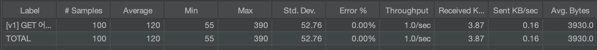
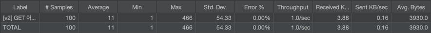
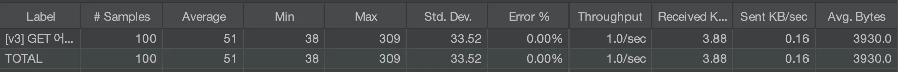
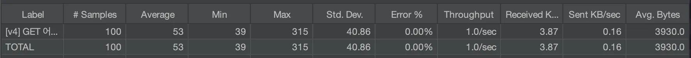
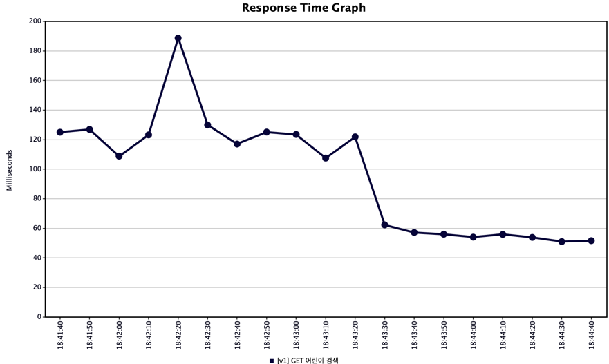
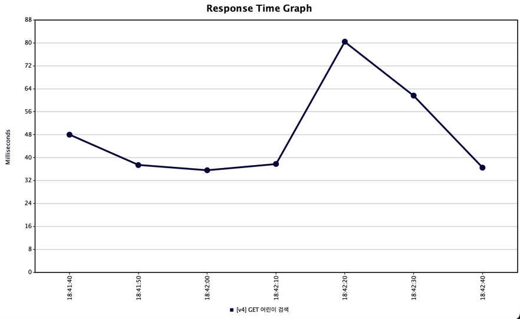

# 🚀 JMeter를 활용한 Cache 성능/부하 테스트

##  개요
- 개발기간: 2025.05.20(화) ~ 2025.05.23(금)
- 자바버전: OpenJDK 17
- 사용기술: Spring Boot, JPA, QueryDsl, MySQL, Redis, Docker, Apache JMeter
- Cache를 이용한 조회 성능 개선 및 JMeter 활용한 성능테스트 프로젝트

---

## 버전별 조회 기능

### 캐시 방식별 구조 요약
| 버전 | 캐시 방식               | 저장 위치            | 특징                                         |
|------|---------------------|------------------|--------------------------------------------|
| V1   | 미사용                 | -                | 매 요청 DB 조회                                 |
| V2   | Local Memory Cache  | 로컬 JVM           | `@Cacheable` 기반                            |
| V3   | Remote Cache(Redis) | Redis(Key-Value) | Key에 `keyword:page:limit` 형태로 저장           |
| V4   | Remote Cache(Redis) | Redis(Hash)      | `HashKey=keyword`, `Field=page:limit`로 분리 저장 |

### 공통
- QueryDsl 사용
- 페이징 처리
- 검색요청에 응답시 `List<ResponseDto>` 반환
- `Business.name` 컬럼 기준

---

### V1. `LIKE` 조건을 통해 검색하는 API
- 조회할 때마다 DB에 접근하여 조회한 데이터를 응답
### V2. 로컬 메모리 캐시를 활용하여 검색하는 API
- `spring-boot-starter-cache` 의존성 추가
- `Spring AOP` 방식으로 동작하는 `@Cacheable` 어노테이션을 활용해 구현 
- **적용한 이유**
  - 같은 검색어로 반복되는 조회 요청이 많기 때문에, DB에 매번 접근하는 것은 비효율적
  - 검색 결과는 자주 바뀌지 않는 데이터이므로 일정 시간 동안 캐시해두는 것이 유리하다 생각!
  - 비교적 **간단한 구현**이 가능하다!
  - **💡 서버가 재시작되면 캐시가 사라지고, 서버 간 캐시 공유가 되지 않는다.**

### V3. Redis(리모트 캐시)를 활용하여 검색하는 API
- `spring-data-redis` 의존성 추가
- `RedisTemplate`을 이용해 검색어 + 페이지 정보를 `Key-Value`로  저장
- | Redis Key             | Value (JSON 문자열) |
  |-----------------------|------------------|
  | `검색어:페이지번호:페이지당데이터개수` | `JSON 문자열 데이터`   |

- **적용한 이유**
  - `local Cache`는 서버 간 캐시 공유가 되지 않아, 확장성에 한계가 명확함
  - `Redis`는 서버 간 캐시 공유가 가능한 중앙 캐시 서버이므로 `Scale-out` 환경에 적합
  - `Key-Value` 구조이므로 구현이 쉽고, 빠른 조회 속도 확보
  - `Redis TTL` 기능으로 캐시 만료 제어도 간편
  - Key 수가 많아지면 `Redis`에 저장되는 키가 과도하게 늘어날 수 있음

### V4. Redis(리모트 캐시)를 활용하여 검색하는 API
- `RedisTemplate`을 이용해 `Redis`의 `Hash` 자료구조를 사용
- 검색어를 `Hash Key`, `페이지 정보를 Field`로 분리 저장
- | Redis Key           | Hash Field        | Value (JSON 문자열) |
  |---------------------|-------------------|------------------|
  | `searchResults:검색어` | `페이지번호:페이지당데이터개수` | `JSON 문자열 데이터`   |
- **적용한 이유**
  - V3에서 Key 수가 많아지는 문제를 해결하고자 구조 개선
  - 하나의 검색어로 여러 페이지를 저장할 수 있어, Key 관리가 효율적
  - `TTL`을 Hash Key 단위로 통합 관리할 수 있어 운용이 편리함
  - 실제 대용량 트래픽에서도 페이지별 캐싱 구조를 더 정교하게 컨트롤 가능

---

## JMeter를 활용한 성능/부하 테스트

### 1. 얼마나 평균 응답속도가 빨라졌을까?
- **테스트 조건**: 1초에 1명씩, 총 100초간 100명의 사용자가 1회씩 요청
- 단일 검색 키워드에 대해 반복 요청하여, 캐시 효과 측정
#### v1 (DB 조회)

#### v2 (LocalMemory Cache)

#### v3 (Redis + String)

#### v4 (Redis + Hash)

| 버전     | 캐시 방식              | 평균 응답 시간 (ms) | 개선 효과 (v1 대비) |
| ------ | ------------------ | ------------- |---------------|
| **v1** | DB 조회 (MySQL)      | 120 ms        | -             |
| **v2** | Local Memory Cache | 49 ms         | **2.45배 빠름** |
| **v3** | Redis (String 기반)  | 51 ms         | **2.35배 빠름** |
| **v4** | Redis (Hash 기반)    | 53 ms         | **2.26배 빠름** |

### 2. 얼마나 많은 수의 사용자를 감당할 수 있을까?
vUser(Virtual User)를 점진적으로 늘려봤다.

| 단계 | Thread 수 | Ramp-Up (초) | Loop Count |
  | -- | -------- | ----------- | ---------- |
  | 1  | 100      | 100         | 1          |
  | 2  | 300      | 100         | 1          |
  | 3  | 500      | 100         | 1          |
  | 4  | 700      | 100         | 1          |
  | 5  | 1000     | 100         | 1          |

`v1(DB조회)`의 경우, 110~130ms를 유지하다 18:42:20에 병목현상이 발생하였다.
또한 응답의 속도가 일정하지 못하다.

`v4(Redis)`의 경우, 30~40ms를 유지하다가 18:42:20에 똑같이 병목현상이 일어났지만,
빠르게 회복된 것을 확인할 수 있다.

>**❓왜 v1(DB조회)의 응답시간이 중간에 급격히 떨어졌을까?**
>- 테스트조건상 사용자 수는 증가하고 있기에 요청수가 적어져서 그런 것은 아니다.
>- 추정원인을 예상해보면, 초반에는 동시 접속으로 커넥션 풀이 포화되어 응답 지연 발생했고 이후 일부 요청이 종료되며 커넥션 풀 여유가 생기고, 처리 속도가 회복됐다고 볼 수 있다.
>- 또한, JVM Warm-up 또는 DB 캐시 적중률 증가 등의 요소로 인해 회복됐다고도 예상해볼 수 있다.

---

### ✅ 따라서
단순 조회 API라 하더라도 **부하에 따른 병목현상**은 응답 성능에 영향을 미치며,
캐시 적용 여부가 시스템 안정성에 큰 차이를 만들어내는 것을 볼 수 있었다.
